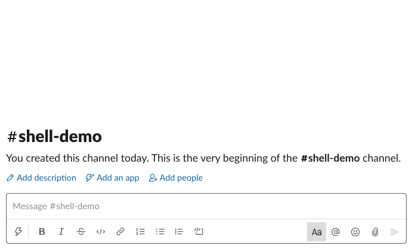

# Slack-Shellbot

A shell bot for Slack. A demo is worth a thousand words.

## Contributing

This bot is built with [slack-ruby-bot-server-events](https://github.com/slack-ruby/slack-ruby-bot-server-events). See [CONTRIBUTING](CONTRIBUTING.md).

## Copyright and License

Copyright (c) 2016-2025, Daniel Doubrovkine, Artsy and [Contributors](CHANGELOG.md).

This project is licensed under the [MIT License](LICENSE.md).
